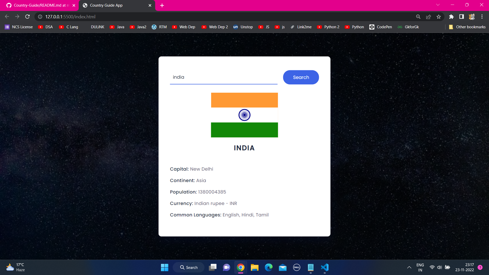

 

<h1 align="center">
    
     
    <b>Country Guide</b>
     
    
    
   
</h1>

<h4 align = "center">
A Laboratory Exercise in Computer Programming 2 that implements the Try and Catch Functionality as well as File Handling. I make the activity more interesting by adding continue the game repeatedly.
</h4>

## **Run the Program** 📜
 To run the program, the device must have:
 - IDE (Vs Code)

## **Instruction of the Game** 📚
1. In search box write Country name.
2. Click the search button
3.  it Saw country Flag, Capital, Continent, Population, Currency & Common Languages.

## **Contribution** 🔥
If you wish to help improve this project, fork this repo and submit your own pull request. If you discover a problem with this project, please report it to the issue page. Thank you very much   😊.

## **Thank you** 💖
If you like this project just click ⭐ and share it with others.

